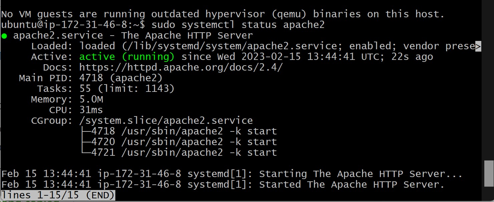
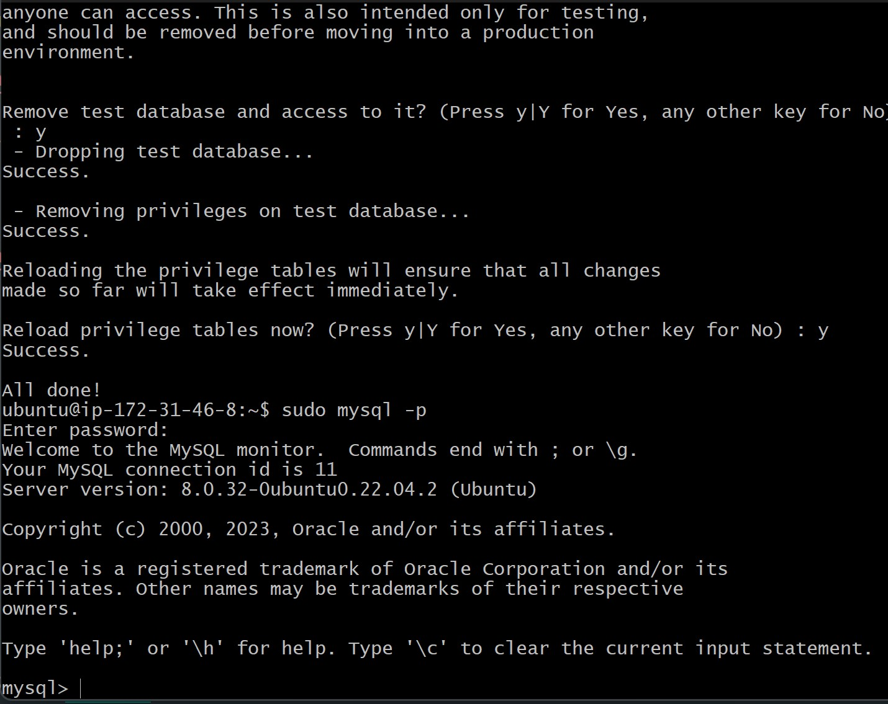
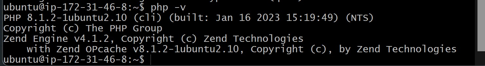
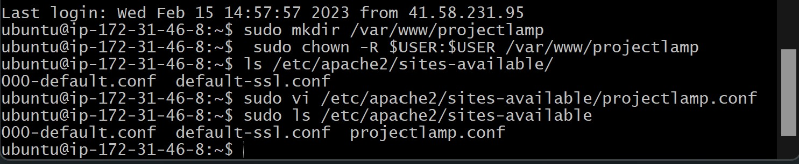
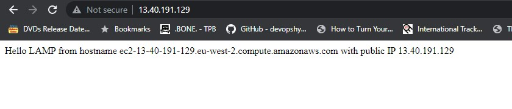
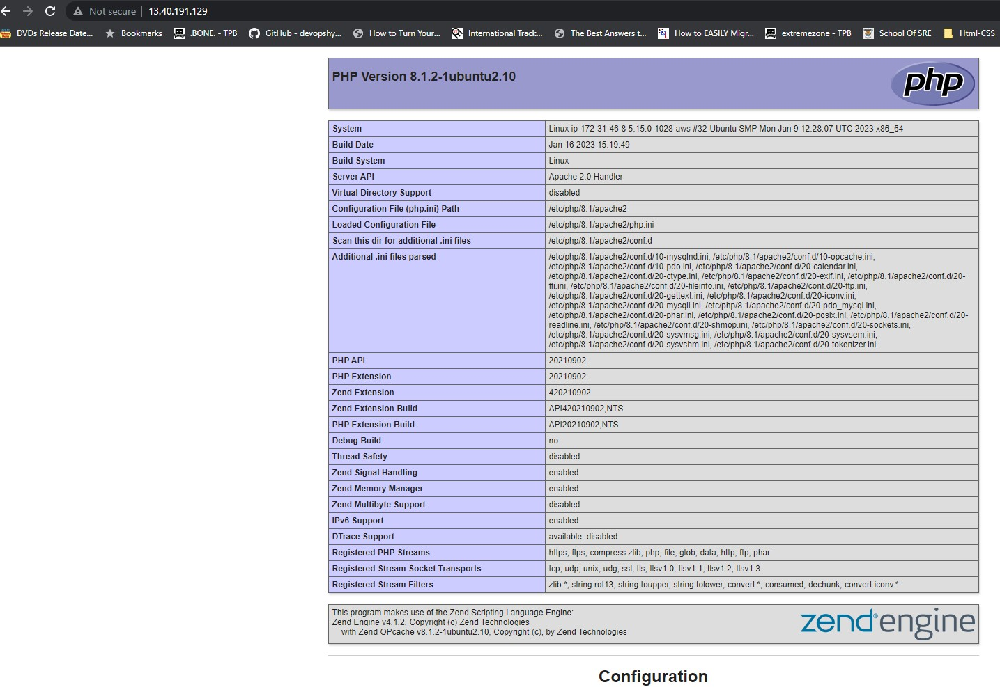

# Project-1: LAMP STACK IMPLEMENTATION

## Step 1 - Installing apache

`sudo apt update`

`sudo apt install apache2`

`sudo systemctl status apache2`

## Step 2 - Installing mysql

`sudo apt install mysql-server`

### Confirm mysql status

`sudo mysql`

## Step 3 - Instaling PHP

`sudo apt install php libapache2-mod-php php-mysql`

### confirm php installation

`php -v`

## Step 4 - Creating virtual host on apache webserver

`sudo mkdir /var/www/projectlamp`

` sudo chown -R $USER:$USER /var/www/projectlamp`

`sudo vi /etc/apache2/sites-available/projectlamp.conf`

### confirm new file in site-available directory

### enable new site

`sudo a2ensite projectlamp`

`sudo a2dissite 000-default`

`sudo apache2ctl configtest`

`sudo systemctl reload apache2`

`sudo echo 'Hello LAMP from hostname' $(curl -s http://169.254.169.254/latest/meta-data/public-hostname) 'with public IP' $(curl -s http://169.254.169.254/latest/meta-data/public-ipv4) > /var/www/projectlamp/index.html`

`http://<Public-IP-Address>:80`

# Step 5 - Enable PHP on the website

`sudo vim /etc/apache2/mods-enabled/dir.conf`

`sudo systemctl reload apache2`

`vim /var/www/projectlamp/index.php`

`<?php
phpinfo();`

